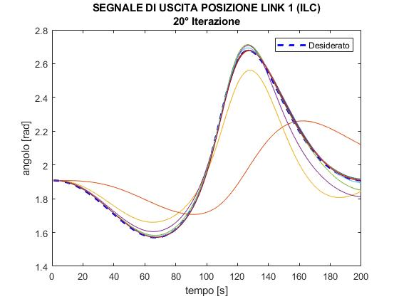
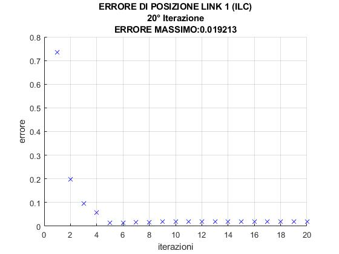
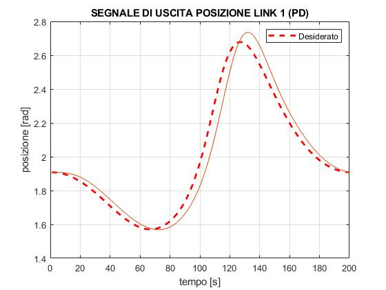
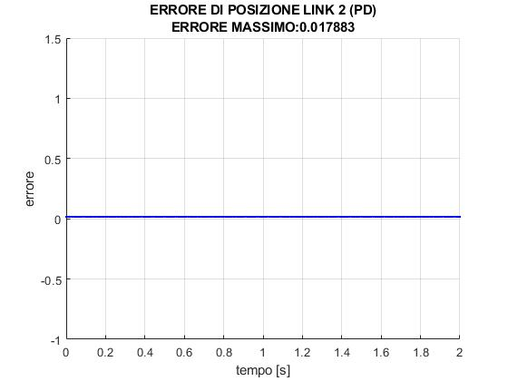
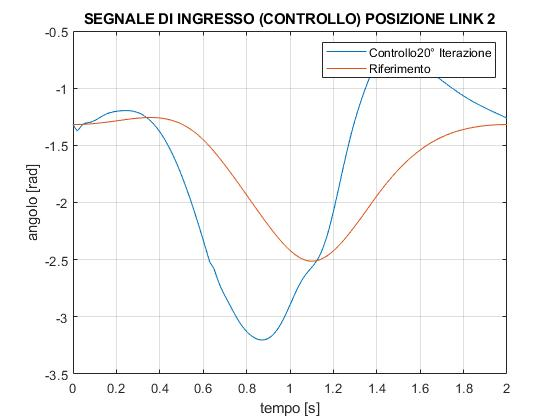
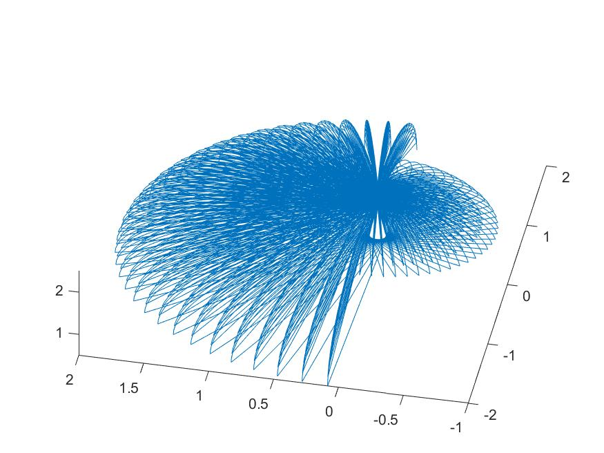
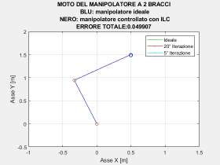
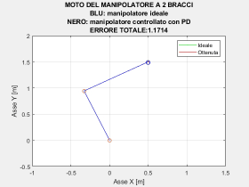

<p align="center">
  
</p>

<p align="center">
  
  
  
  
</p>

Implementation and simulation in **MATLAB/Simulink** of an **Iterative Learning Control (ILC)** algorithm for trajectory tracking of a **2-DOF planar manipulator**. The repository also includes kinematics and dynamics for a **6-DOF anthropomorphic arm with spherical wrist**, developed during the thesis work.

**Context**: Bachelor thesis in Computer Engineering — *Algoritmo di apprendimento iterativo per braccio robotico* (Roma Tre University, A.Y. 2018/2019).

---

## Quick navigation

- [Overview](#overview)
- [Project structure](#project-structure)
- [Results & media](#results--media)
- [Getting started](#getting-started)
- [Main components](#main-components)
- [Requirements](#requirements)
- [Thesis & references](#thesis--references)

---

## Overview

| Module | Description |
|--------|-------------|
| **Planar 2-DOF** | Dynamics (Lagrange), ILC and PD control, circular trajectory generation and simulation. |
| **Kinematics** | Denavit–Hartenberg utilities, direct/inverse kinematics for 2-DOF, 3-DOF and 6-DOF serial arms. |
| **6-DOF arm** | Anthropomorphic arm with spherical wrist: DH parameters, forward/inverse kinematics. |

---

## Project structure

```
ILC_2DOF_PlanarArm/
├── assets/               # Output images and videos (ILC/PD results, animations)
├── matlab/
│   ├── kinematics/       # DH matrix, dk03, dk06, ik02, ik03, ik06, ik36
│   ├── planar_2dof/      # manipulator2dof, ILC2dof, PD2dof, Traiettoria_Circolare_Corretta
│   └── six_dof/          # SIXDOF_DHparameters
├── simulink/             # Simulink models (controller2.slx, robot2link)
├── docs/                 # Thesis PDF and extra documentation
├── startup.m             # Adds matlab/ to path (run from project root)
└── README.md
```

---

## Results & media

Outputs from the ILC and PD simulations (figures and animations) are stored in **`assets/`**.

### ILC — output position and error

| Link 1 position | Link 2 position | Position error (Link 1) | Position error (Link 2) |
|-----------------|-----------------|--------------------------|--------------------------|
|  |  |  |  |

### PD control — comparison

| Link 1 position (PD) | Link 2 position (PD) | Position error L1 (PD) | Position error L2 (PD) |
|---------------------|----------------------|------------------------|-------------------------|
|  |  |  |  |

### Control signals and workspace

| Control position L1 | Control position L2 | 6-DOF workspace |
|--------------------|--------------------|-----------------|
|  |  |  |

### Animations

**ILC** — manipulator motion vs desired trajectory over iterations:



**PD** — manipulator motion with proportional-derivative control:



---

## Getting started

1. **Clone the repository** and open MATLAB.
2. **From the project root**, run:
   ```matlab
   startup
   ```
   This adds all `matlab/` subfolders and `simulink/` to your path (so `controller2.slx` is found).
3. **Run scripts** from the project root :
   - Circular trajectory only: `matlab/planar_2dof/Traiettoria_Circolare_Corretta`
   - 2-DOF dynamics (Lagrange, state-space): `matlab/planar_2dof/manipulator2dof`
   - ILC control (uses `simulink/controller2.slx`): `matlab/planar_2dof/ILC2dof`
   - PD control (uses `controller2.slx`): `matlab/planar_2dof/PD2dof`
   - 6-DOF arm (DH + visualization): `matlab/six_dof/SIXDOF_DHparameters`

> **Note:** `ILC2dof` and `PD2dof` call `sim('controller2')`. The model `controller2.slx` is in `simulink/`; `startup` adds that folder to the path when you run from the project root.

---

## Main components

### Kinematics (`matlab/kinematics/`)

| File | Description |
|------|-------------|
| `DHmatrix.m` | Builds 4×4 DH transformation from a single row of parameters. |
| `ik02.m` | Inverse kinematics for 2-DOF planar arm (position → joint angles). |
| `dk03.m` | Direct kinematics for 3-DOF arm (joint angles → end-effector position). |
| `dk06.m` | Direct kinematics for 6-DOF arm. |
| `ik03.m`, `ik06.m`, `ik36.m` | Inverse kinematics for 3-DOF and 6-DOF (arm + wrist). |

### Planar 2-DOF (`matlab/planar_2dof/`)

| File | Description |
|------|-------------|
| `manipulator2dof.m` | Lagrange equations, state-space form, linearization. |
| `Traiettoria_Circolare_Corretta.m` | Circular trajectory in Cartesian space and joint space (uses `ik02`). |
| `ILC2dof.m` | ILC algorithm with circular reference; iteratively updates control input. |
| `PD2dof.m` | PD control on the same 2-DOF setup (single run). |

### 6-DOF (`matlab/six_dof/`)

| File | Description |
|------|-------------|
| `SIXDOF_DHparameters.m` | Builds 6-DOF robot with DH parameters, solves inverse kinematics and visualizes. |

---

## Requirements

- **MATLAB** (tested with Robotics System Toolbox for `RigidBodyTree` and related functions).
- **Simulink** for running `ILC2dof` and `PD2dof` (they call the `controller2` model).

---

## Thesis & references

- Thesis PDF: [docs/tesi.pdf](docs/tesi.pdf) — *Algoritmo di apprendimento iterativo per braccio robotico*, Roma Tre, A.Y. 2018/2019.
- ILC updates the control signal from trial to trial using position and velocity error (e.g. \( u_{k+1} = u_k + \phi\, e_{\text{pos}} + \gamma\, e_{\text{vel}} \)).

---

<p align="center">
  <sub>Bachelor thesis project — Roma Tre University · Computer Engineering</sub>
</p>
